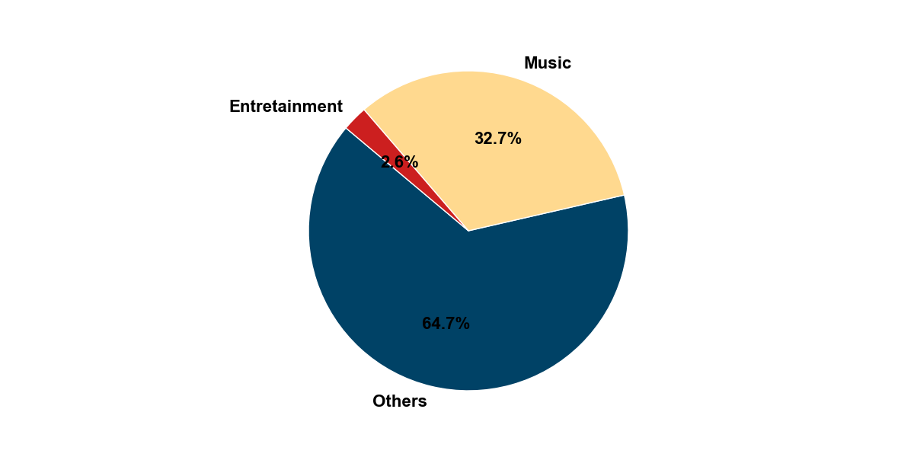
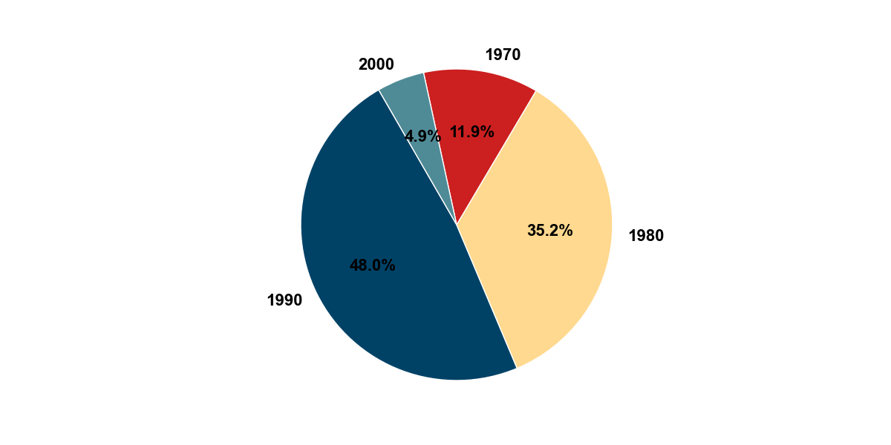
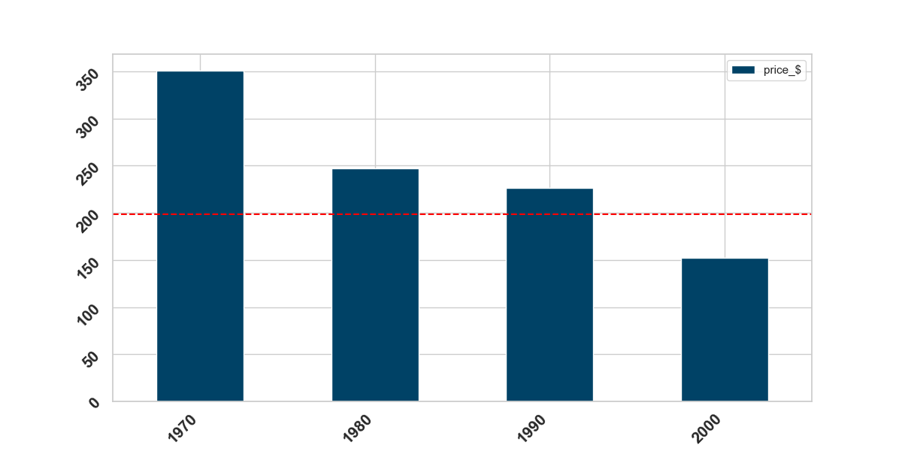
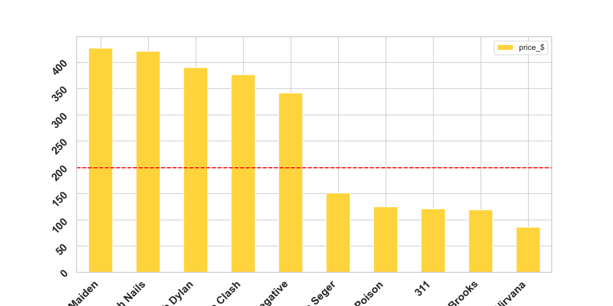
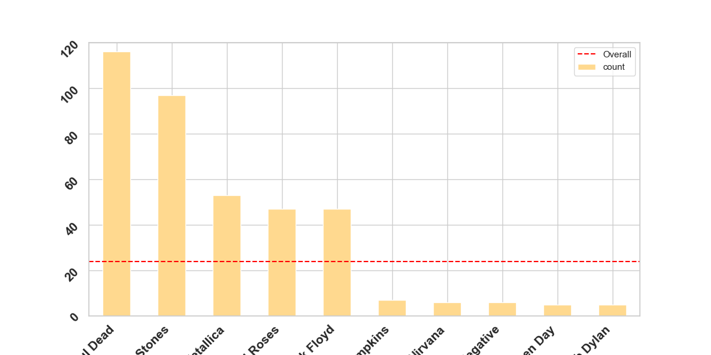
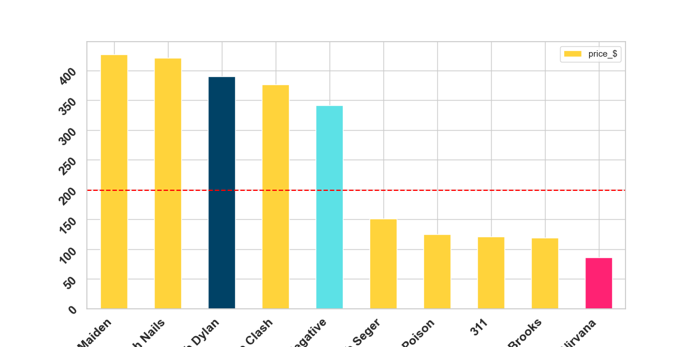
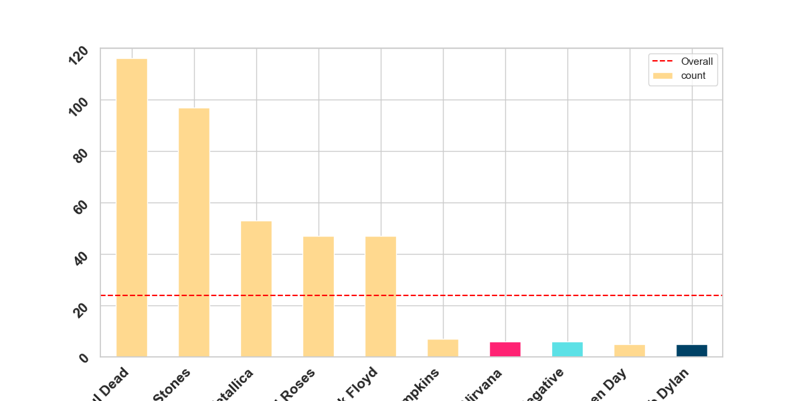
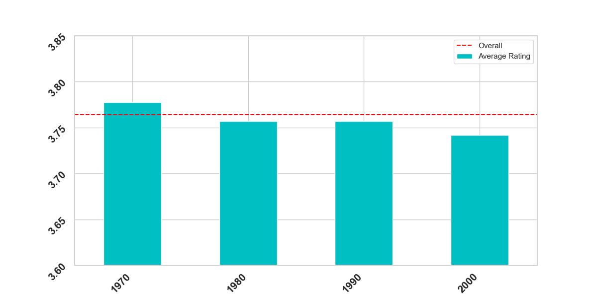
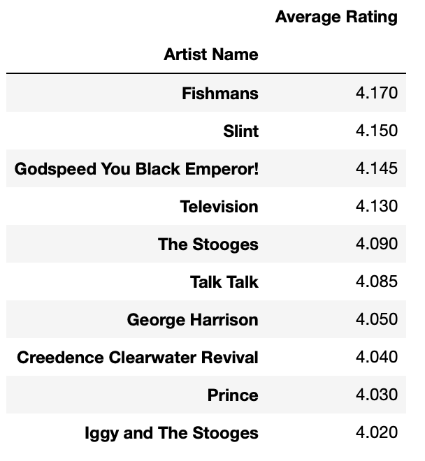

# Vintage T-Shirt Analysis Project
### project-II

This project aims to utilize web scraping techniques to extract 
information from a public database on vintage t-shirts and conduct 
analysis on various aspects including price, popularity, and availability.

## Scrapping Approach
To begin, we access the main page of a t-shirt company's website
 to explore its configuration and structure. We target all products 
 filtered as t-shirts and leverage the selection list provided to 
 filter categories. By analyzing products in different collections, we observe that each item belongs to at least one decade collection, allowing us to filter by decade to ensure unique categorization without duplicates. We retrieve the description, selling price, collection (decade), and link to product specifications by analyzing the HTML code and targeting the main structure shared by all products ("Product Card"). Considering pagination for collections with multiple pages, we extract values from each product on every page, consolidate them into a DataFrame, and concatenate them for further analysis.

## Data Analysis
After data scraping, we transform the data and apply visualizations to draw conclusions:

### Main Products Availability and Price by Decade

1. Analyze the percentage of products by category and decade, with a notable emphasis on music-related items from the 1980s to the 1990s.

**Percentaje of items by category**

**Percentaje of items by decade**

2. Illustrate how the decade affects the price, highlighting significantly higher average prices for music t-shirts from the 1970s.

**Item average price by decade**

### Other Factors Affecting Price

Analyze top 5 artists impacting average price and availability (nº of items in the market) through different plots, considering factors such as popularity and rarity of shirts by artist.

**Top 5 heads/taile artists sorted by item average price**

**Top 5 heads/taile artists sorted by item availability**

Consider how availability may affect pricing by comparing bar plots of pricing and availability by artist. 

**Comparison plots**

While higher prices may align with lower market availability in some cases, no clear correlation is established.

###  Delving into the popularity of artist: Comparison with Best-Rated Rock Albums

To further analyze and answer new questions, we gather a public dataset based on the top-rated rock albums in history:

**Average rating over decades**

Display the best-rated rock albums over decades, revealing no significant difference between decades.

**Top 10 Rock Artists Rated:** 

Present a table showing the highest-rated rock artists, noting that they may not necessarily align with the most prominent artists in the vintage t-shirt market.

## Conclusions
Through this analysis, we gain insights into the vintage 
t-shirt market, including trends, pricing dynamics, and factors 
influencing consumer demand. While music-related items, especially from the 1970s to the 1990s, dominate the market, no clear correlation is found between album ratings and t-shirt popularity or pricing. Further research may explore additional variables to enhance understanding of market trends.